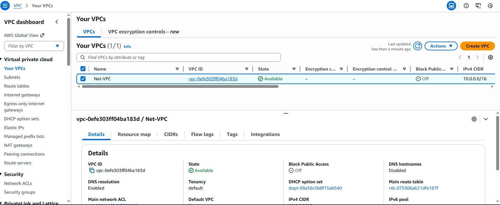
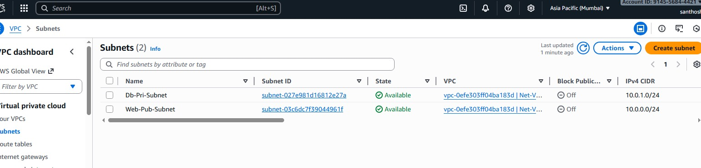
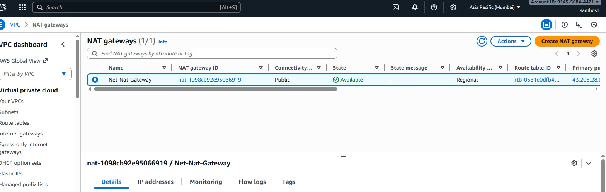
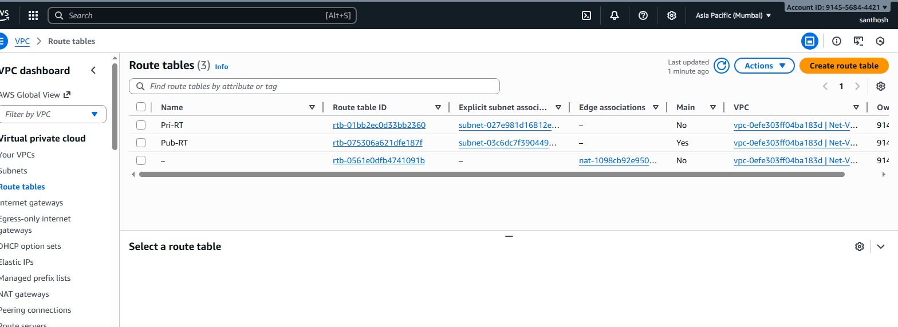
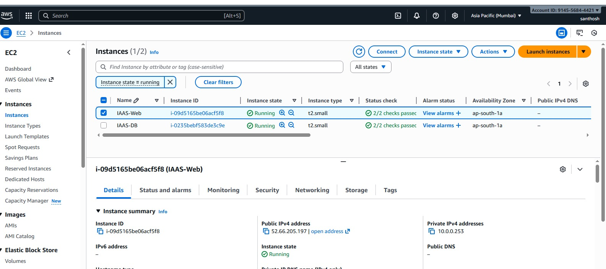

# 🏗️ Secure AWS 2-Tier Architecture: Apache-PHP Web Server on Public Subnet with Private MySQL Database

This project demonstrates a secure **2-tier web application** deployment on AWS, where:

- **Apache + PHP Web Server** runs in a **public subnet**
- **MySQL Database** runs in a **private subnet**
- Database is **never exposed to the internet**
- Secure communication happens only through internal VPC traffic

The design follows AWS networking best practices using **VPC, Subnets, NAT Gateway, Route Tables, and Security Groups**.

---

## 📚 Table of Contents

- [Architecture Diagram](#-architecture-diagram)
- [Project Workflow](#-project-workflow)
  1. [Create VPC](#1️⃣-create-vpc)
  2. [Create Subnets](#2️⃣-create-subnets)
  3. [Internet Gateway](#3️⃣-create-and-attach-internet-gateway)
  4. [NAT Gateway](#4️⃣-create-nat-gateway)
  5. [Route Tables](#5️⃣-create-route-tables)
  6. [Security Groups](#6️⃣-configure-security-groups)
  7. [Launch Web Server](#7️⃣-launch-ec2-web-server)
  8. [Install Apache & PHP](#8️⃣-install-apache--php)
  9. [Database Setup](#9️⃣-create-mysql-user--permissions)
  10. [Application Setup](#🔟-create-database-and-insert-sample-data)
  11. [Upload Web Files](#1️⃣1️⃣-upload-web-files-using-filezilla)
  12. [Test DB Access](#1️⃣2️⃣-test-db-access-from-web-server)
  13. [Browser Test](#1️⃣3️⃣-browser-test)
- [Security Highlights](#-security-highlights)
- [Repository Structure](#-repository-structure)
- [Conclusion](#-conclusion)

---

## 📌 Architecture Diagram


---

# 🚀 Project Workflow

Below are the complete steps followed with screenshots.

---

## 1️⃣ Create VPC (10.0.0.0/16)

- Create custom VPC  
- Enable DNS Resolution  

📷 Screenshot:  


---

## 2️⃣ Create Subnets

- **Public Subnet:** `10.0.0.0/24`  
- **Private Subnet:** `10.0.1.0/24`

📷 Screenshot:  


---

## 3️⃣ Create and Attach Internet Gateway

- Create Internet Gateway  
- Attach IGW to VPC  

📷 Screenshot:  


---

## 4️⃣ Create NAT Gateway

- Create NAT Gateway in Public Subnet  
- Assign Elastic IP  

📷 Screenshot:  


---

## 5️⃣ Create Route Tables

### 🔹 Public Route Table
- `0.0.0.0/0` → Internet Gateway  

📷 Screenshot:  


---

### 🔹 Private Route Table
- `0.0.0.0/0` → NAT Gateway  

📷 Screenshot:  


---

## 6️⃣ Configure Security Groups

### 🔹 Web-SG (Web Server)

Inbound Rules:

| Type | Port | Source |
|------|------|--------|
| HTTP | 80  | 0.0.0.0/0       |
| SSH  | 22  | Your Public IP  |

📷 Screenshot:  


---

### 🔹 DB-SG (Database Server)

Inbound Rules:

| Type | Port | Source |
|------|------|--------|
| MySQL | 3306 | Web-SG |
| SSH   | 22   | Web-SG |

📷 Screenshot:  


---

## 7️⃣ Launch EC2 Web Server (Apache+PHP)

- AMI: Ubuntu  
- Subnet: Public  
- SG: Web-SG  
- Key Pair: Linux-Keypair  

📷 Screenshot:  


---

## 8️⃣ Install Apache & PHP

SSH into Web EC2:

```bash
sudo apt update
sudo apt install apache2 -y
sudo apt install php libapache2-mod-php php-mysql -y
sudo systemctl restart apache2
```

📷 Screenshot:  


---

## 9️⃣ Create MySQL User & Permissions

Login to DB MySQL:

```sql
CREATE USER 'appusr'@'%' IDENTIFIED BY 'sqluser2025';
GRANT ALL PRIVILEGES ON *.* TO 'appusr'@'%' WITH GRANT OPTION;
FLUSH PRIVILEGES;
```

📷 Screenshot:  


📷 Screenshot:  


---

## 🔟 Create Database and Insert Sample Data

```sql
CREATE DATABASE appdb;
USE appdb;

CREATE TABLE Course(
  CourseID INT,
  CourseName VARCHAR(1000),
  Rating NUMERIC(2,1)
);

INSERT INTO Course VALUES
(1,'AWS Certified Solutions Architect – Associate',4.5),
(2,'AWS Certified Solutions Architect – Professional',4.6),
(3,'AWS Certified DevOps Engineer – Professional',4.7);
```

📷 Screenshot:  


---

## 1️⃣1️⃣ Upload Web Files using FileZilla

Upload `index.php` to:

```
/var/www/html
```

📷 Screenshot:  


---

## 1️⃣2️⃣ Test DB Access from Web Server

```bash
sudo mysql -h 10.0.1.xx -u appusr -p
```

📷 Screenshot:  


---

## 1️⃣3️⃣ Browser Test

Open in browser:

```
http://<EC2-Public-IP>/index.php
```

Expected Result → AWS Certification Table

📷 Screenshot:  


---

# 🛡️ Security Highlights

- Database in **private subnet** (no public IP)
- Web server is the only entry point
- NAT used for secure outbound access
- Security Groups follow least-privilege model
- Full network isolation using VPC

---

## 📂 Repository Structure

```
Secure-AWS-2-Tier-Architecture/
│
├─ README.md
└─ screenshots/
     ├─ new arc.drawio.png
     ├─ vpc.jpeg
     ├─ subnets.jpeg
     ├─ Internet gatway.jpeg
     ├─ nat-gateway.jpeg
     ├─ Route-Table.jpeg
     ├─ prv-subnet-route.jpeg
     ├─ web-inbound-rule.jpeg
     ├─ DB-inbound rule.jpeg
     ├─ IAAS-WEB.jpeg
     ├─ install apache services.jpeg
     ├─ creat sql root acc.jpeg
     ├─ grant privileges on sql claindt.jpeg
     ├─ application create in db.jpeg
     ├─ FILEZILA insert html file.jpeg
     ├─ iaas-web access the db via http.jpeg
     ├─ web to db access.jpeg
```

---

## ✅ Conclusion

This architecture provides a **secure, scalable and production-ready** environment for deploying web applications on AWS with strict network isolation.

